## STIVEN ESNEIDER PARDO GUTIERREZ

Este repositorio presenta el parcial para el segundo corte de TDSE, habia tenido un problema con los usuarios de github y por eso los commits se estan realizando hasta este momento 

video del funcionamiento: <video controls src="20260324-1736-26.9243981.mp4" title="Title"></video> es el video "20260324-1736-26.9243981.mp4" adjunto en el repositorio, aclaro esto en caso de que el readme no lo muestre

## Estructura del proyecto 

La carpeta target se genera al ejecutar el proyecto, por ello no esta en el repositorio

## Descripción del Proyecto
Este proyecto implementa un servicio REST basado en Spring Boot que calcula la secuencia de Collatz para un número entero positivo dado. Incluye un cliente web asíncrono para interactuar con el servicio y está diseñado para ser desplegado en contenedores Docker,
se realiza como solucion al parcial del segundo corte de TDSE

Verificamos la correcta compilacion del proyecto 
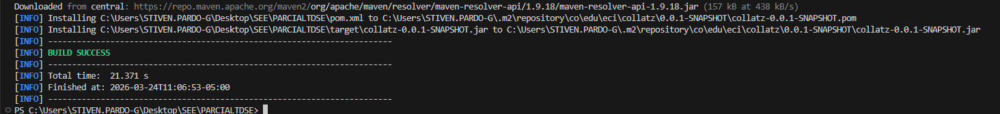

Construccion de la imagen docker
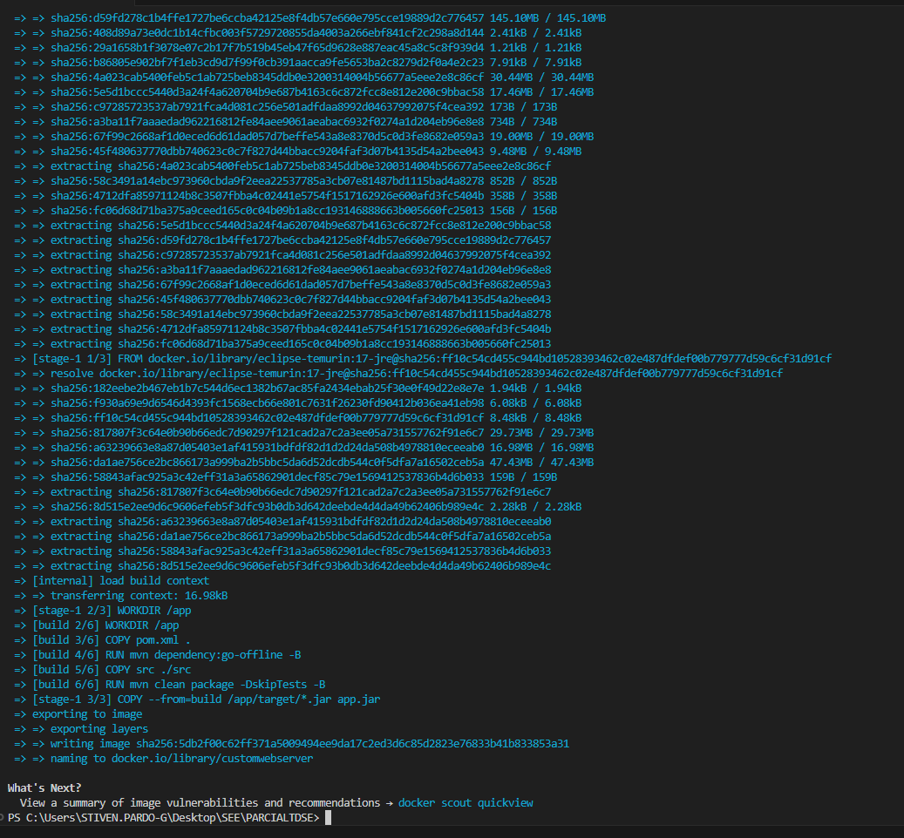

Corremos la instancia del contenedor
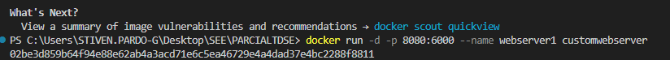
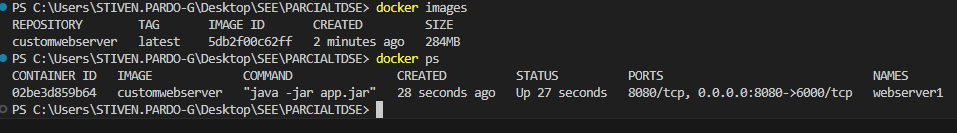
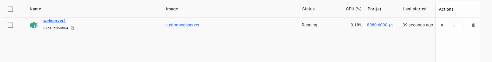
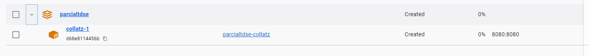

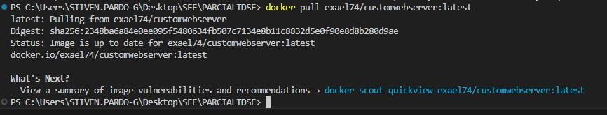

Habilitamos docker en la instancia: 
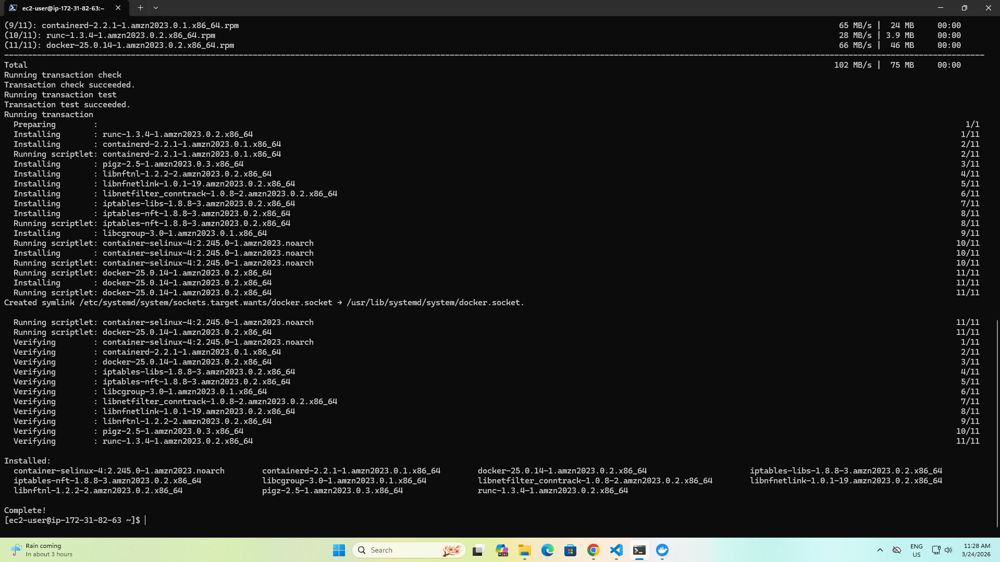
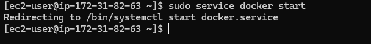

Implementado con spring boot
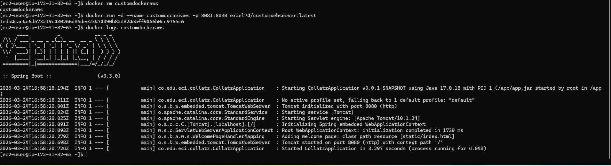

Finalmente usamos este link luego de realizar el despliegue de AWS
http://ec2-44-202-109-82.compute-1.amazonaws.com:8081/collatzsequence?value=13

donde obtenemos el siguiente resultado 

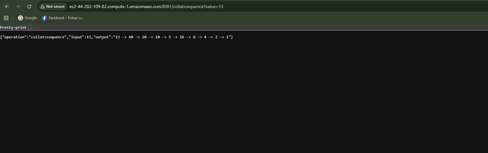

